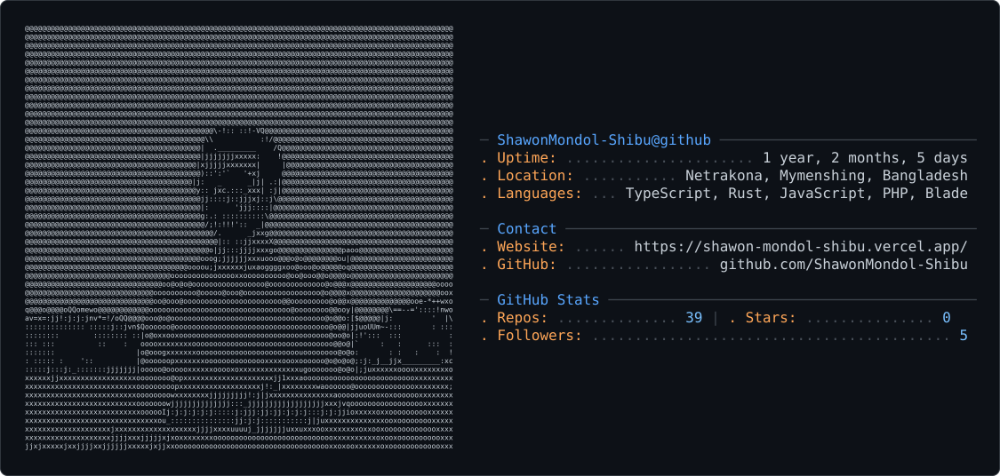

<picture>
  <source media="(prefers-color-scheme: dark)" srcset="dark_mode.svg" />
  <source media="(prefers-color-scheme: light)" srcset="light_mode.svg" />
  
</picture>

<h1 align="center">
  
</h1>

<!-- 

 -->

 

  

<!--# 👨‍💻 About Me

| 🚀 Focus Area | 💡 Details |
|---|---|
| 🔭 **Currently Working On** | Engineering high-performance web applications and refining my digital portfolio |
| 🤝 **Open Source Collaboration** | Contributing to and collaborating within the **TypeScript**, **Rust**, and **Next.js** ecosystems |
| ⚡ **Development Philosophy** | Building scalable, maintainable, type-safe, and architecturally clean software |
| 💼 **Availability** | Open for freelance projects, technical consulting, and remote collaborations |
| 🧠 **Learning & Research** | Exploring system design, distributed systems, backend architecture, and systems programming |

  -->

# 🛠️ Tech Stack

  <h2>📊 GitHub Analytics</h2>

| GitHub Stats | GitHub Streak | Top Languages |
| :---: | :---: | :---: |
|  |  |  |

